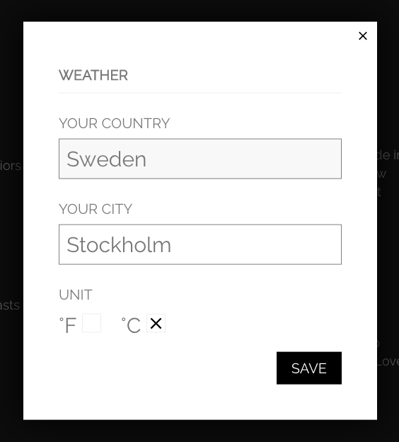
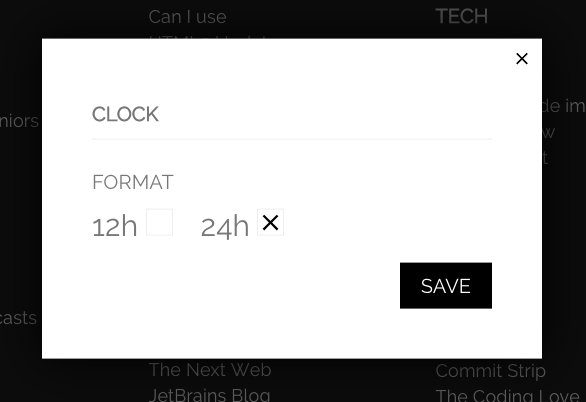
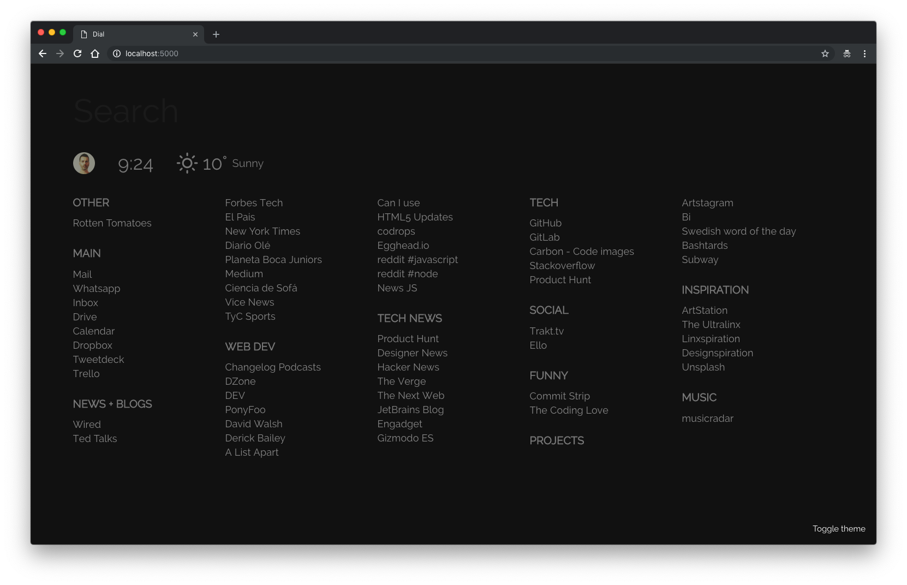
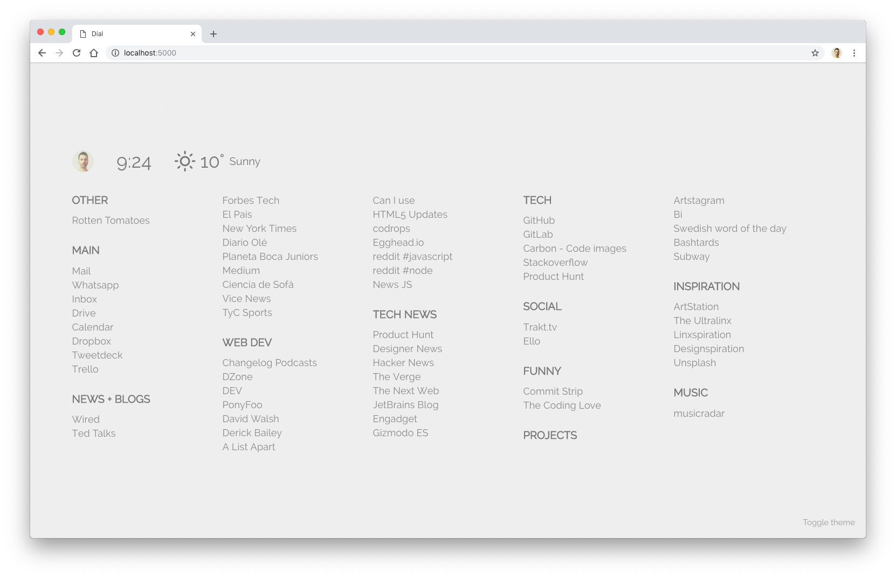

# Dial

Dial it's my launcher for frequent websites.
It could replace the newtab page on Chrome or any browser.
If you want to have your own links, fork this repo, change the `data.json` file and build it.

[Demo](https://home.singuerinc.com/)

### Search


> Tip: Search and press enter: navigates to the first occurrence. Or search and use the arrows keys to navigate.

### Weather config window



### Clock config window



## Themes

### Dark



### Light



## Installation

## develop

```sh
# install
yarn
# compile js
yarn build:watch
# serve at :5000
yarn start
```

## build

```sh
yarn build
```

### TODO

- [x] Navigate through results with keys
- [ ] Options page
- [ ] Add/Edit/Remove links
- [ ] Profile image upload
- [ ] Sync
- [ ] Backgrounds?
